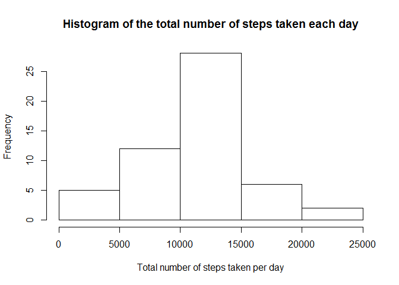
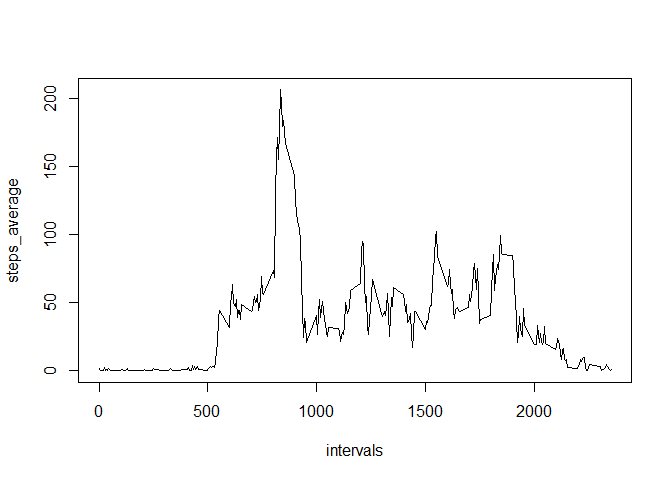
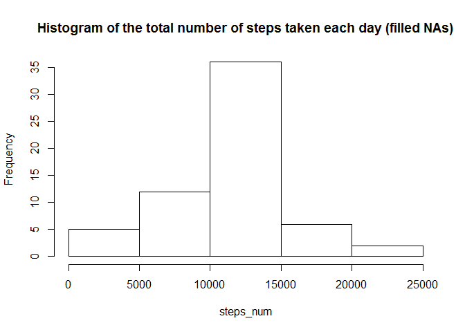
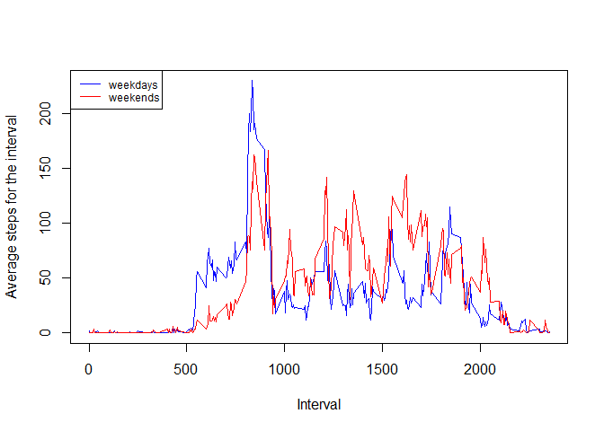

# Reproducible Research: Peer Assessment 1

## Loading and preprocessing the data
The `unz()` function is used to unzip and extract the data file without saving it 
in a folder. The raw data was preprocessed to change dates to the Date class and 
saved in the variable `dataraw`


```r
dataraw <- read.csv(unz("activity.zip", "activity.csv"))
dataraw$date <- as.Date(dataraw$date)
```

## What is mean total number of steps taken per day?
For computing the mean of the total number of steps taken per day the NA values 
were removed from the data:

```r
notNAs <- dataraw[!is.na(dataraw$steps),]
```
For creating the histogram of the total number of steps taken each day, first 
the range of days was defined and then with a `for` loop the total number of 
for each day was calculated:

```r
days <- unique(notNAs$date)
steps_num <- numeric(length(days))

for(i in seq_along(days)){
      steps_num[i] <- with(subset(notNAs, notNAs$date == days[i]), sum(steps))
}

hist(steps_num, main = "Histogram of the total number of steps taken each day",
     xlab = "Total number of steps taken per day")
```

 
  
The mean of the total number of steps taken per day is:

```r
mean(steps_num)
```

```
## [1] 10766.19
```
And the median:

```r
median(steps_num)
```

```
## [1] 10765
```
## What is the average daily activity pattern?
The average daily activity pattern is showed with time series plot of the 5-minute 
interval (x-axis) and the average number of steps taken, averaged across all days 
(y-axis). For this plot the intervals were defined and the average of the steps 
for each interval were calculated:

```r
intervals <- unique(notNAs$interval)
steps_average <- numeric(length(intervals))
for(i in seq_along(intervals)){
      
      steps_average[i] <- with(subset(notNAs, notNAs$interval == intervals[i]),
                               mean(steps))
}

plot(intervals, steps_average, type="l")
```

 

```r
maxsteps <- max(steps_average)
maxinterval <- intervals[steps_average == maxsteps]
```
On average the 835 interval contains the maximum number of steps, 
wich was calculated at 206.1698113.

## Imputing missing values
Some values were missing and they may introduce bias into some calculations or 
summaries of the data. Therefore approximate values were introduced to avoid 
computing with the NAs. The number of NAs was calculated with:

```r
NAs <- is.na(dataraw$steps) 
sum(NAs)
```

```
## [1] 2304
```
A new data set was created filling the NAs with the computed steps average for 
the interval where the data was missing:

```r
row_number <- 1:17568

row_number <- row_number[NAs]

datafilled <- dataraw

for (i in row_number){
      datafilled$steps[i] <- steps_average[intervals == datafilled$interval[i]]
}
```
Then the histogram, mean and median values for the total number of steps taken 
each day were computed again with the filled data:

```r
days <- unique(datafilled$date)
steps_num <- numeric(length(days))

for(i in seq_along(days)){
      
      steps_num[i] <- with(subset(datafilled, datafilled$date == days[i]),
                           sum(steps))
      
}

hist(steps_num, main = "Histogram of the total number of steps taken each day (filled NAs)")
```

 

```r
mean(steps_num)
```

```
## [1] 10766.19
```

```r
median(steps_num)
```

```
## [1] 10766.19
```
Filling the missing values with the average for the respective intervals 
had no effect in the computed mean value and it had an small effect in the median 
value as more values with decimals were present in the range.

## Are there differences in activity patterns between weekdays and weekends?
For comparing the data for weekdays and weekends, the data was divided into this 
two sets and then plotted with different colors. The function is used to set 
`Sys.setlocale()` the language of the weekdays to English and avoid any problem 
with different default systems languages:


```r
Sys.setlocale("LC_TIME", "English")
```

```
## [1] "English_United States.1252"
```

```r
weekend <- weekdays(datafilled$date)
weekend <- as.logical((weekend == "Saturday") + (weekend == "Sunday"))

daytype <- function(weekend){
      if(weekend) "weekend"
      else "weekday"
}

day_type <- sapply(weekend, daytype)

datafilled <- cbind(datafilled, day_type)

dataweekday <- datafilled[!weekend,]
dataweekend <- datafilled[weekend,]

steps_weekday <- numeric(length(intervals))
steps_weekend <- numeric(length(intervals))

for(i in seq_along(intervals)){
      
      steps_weekday[i] <- with(subset(dataweekday, dataweekday$interval == intervals[i]),
                               mean(steps))
      steps_weekend[i] <- with(subset(dataweekend, dataweekend$interval == intervals[i]),
                               mean(steps))
}

plot(intervals, steps_weekday, type="l", col="blue",
     ylab = "Average steps for the interval", xlab = "Interval")
lines(intervals, steps_weekend, col="red")
legend("topleft", cex = 0.75, lwd = c(1,1), col = c("blue", "red"), legend = c("weekdays", "weekends"))
```

 

The plot shows how there were in average more steps in intervals from 500 to 100 in the weekdays, while in the weekend the steps were in average more than in the weekdays during the intervals higher than 1000.
